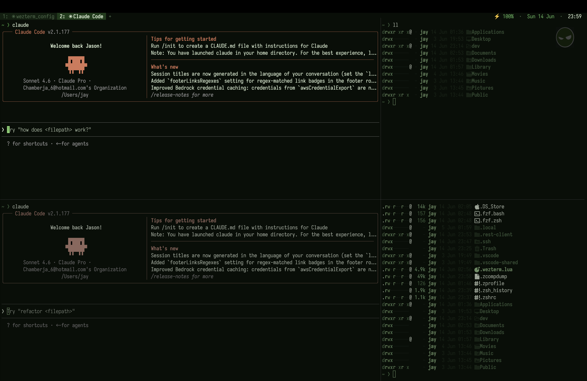

# jterm



Personal WezTerm terminal config with cross-platform support for macOS and Windows.

## Features

- Tokyo Night theme with frosted glass transparency
- 2x2 pane grid on startup (65% / 35% split)
- Geist Mono Nerd Font
- Custom prompt with directory and git branch
- Status bar with battery, date and time
- Pane navigation and zoom keybindings
- Shell config with autosuggestions, fzf, eza, zoxide, bat, lazygit, delta

## Setup

### macOS

```bash
git clone git@github.com:AimzJson/jterm.git ~/.config/wezterm
cd ~/.config/wezterm
./setup.sh
```

Restart WezTerm after setup.

### Windows

```powershell
git clone git@github.com:AimzJson/jterm.git $env:USERPROFILE\.config\wezterm
cd $env:USERPROFILE\.config\wezterm
.\setup.ps1
```

Restart WezTerm and PowerShell after setup.

## WezTerm keybindings

| Key | Action |
|---|---|
| `Cmd/Ctrl+Shift+T` | New tab with 2x2 grid |
| `Cmd/Ctrl+Shift+Arrow` | Navigate panes |
| `Cmd/Ctrl+Shift+Z` | Zoom active pane |
| `Cmd+W` | Close tab |
| `Cmd+click` | Open hyperlink |

## Shell aliases

| Alias | Command |
|---|---|
| `ls` | `eza --icons` |
| `ll` | `eza -l --icons --git` |
| `la` | `eza -la --icons --git` |
| `lt` | `eza --tree --icons --level=2` |
| `cat` | `bat --paging=never` (syntax highlighted) |
| `z <dir>` | Jump to directory via zoxide |

## Tools

### fzf
Fuzzy finder. Press `Ctrl+R` to search command history interactively.

### bat
Syntax-highlighted file viewer. Aliased to `cat` — use it the same way.
```
cat file.lua
bat file.lua
```

### delta
Syntax-highlighted git diffs. Automatic — no commands needed.
```
git diff
git show
git log -p
```

### lazygit
Terminal UI for git. Launch with `lazygit` from any repo.

| Key | Action |
|---|---|
| `Space` | Stage / unstage file |
| `c` | Commit |
| `P` | Push |
| `p` | Pull |
| `?` | Show all keybindings |
| `q` | Quit |

### eza
Modern `ls` replacement with icons and git status. See aliases above.

### zoxide
Smarter `cd` — learns your most visited directories.
```
z projects    # jumps to the best match for "projects"
zi            # interactive fuzzy directory picker
```

